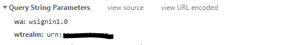

[](https://snyk.io/test/github/bcgov/sp2s3?targetFile=package.json)

# sp2s3
Utility to move all files from a Sharepoint document library to s3, once or cron. Because Sharepoint supports extracting attachements of an incoming email to document library, the utility can therefore automate extracting email attachments to s3 via Sharepoint too.

Works for SharePoint 2010 and newer.

## Install
Choose one of the following verified methods

### From Source
Need latest git and nodejs

```
git clone https://github.com/bcgov/sp2s3.git
cd sp2s3
npm i
node . <opts>
```

### Docker
Need docker cli

```
docker build -t sp2s3 https://github.com/bcgov/sp2s3.git
docker run sp2s3 npm start -- <opts>
```

### Openshift
Need oc cli and logged into openshift target deployment project

```
oc new-app https://github.com/bcgov/sp2s3.git --strategy=source <-e ENV=VALUE> ...
```
An Openshift app is expected to be long running so env *CRON_TIME_SPEC* documented below is mandatory. If a specific time is set in *CRON_TIME_SPEC* rather than wildcard, it is also advised to set *CRON_TIME_ZONE* because time zone defaults to UTC by the builder image.

To uninstall, assuming the app name is the default *sp2s3* and there is no other app with duplicated name

```
oc delete all -l app=sp2s3 --grace-period=0 --force --cascade
```

## Usage
*sp2s3* takes following input parameters in the form of either command line option or environment variable, with command line option taking precedence

| Command Line Opt           | Environment Variable  | Mandatory | Description                                                                                                    |
|----------------------------|-----------------------|-----------|----------------------------------------------------------------------------------------------------------------|
| -s, --sp-url                | SP_URL                | Yes       | sharepoint document library REST API url, for example https://my-site/_vti_bin/ListData.svc/mydoclib                   |
| -A, --sp-auth-scheme               | SP_AUTH_SCHEME                | No       | sharepoint authentication scheme - ntlm or adfs. Default to ntlm if absent                 |
| -u, --sp-user               | SP_USER               | Yes       | sharepoint login user name                                                                                     |
| -d, --sp-domain             | SP_DOMAIN             | Yes       | sharepoint login user domain                                                                                   |
| -p, --sp-password           | SP_PASSWORD           | Yes       | sharepoint login password                                                                                      |
| -R, --sp-adfs-relying-party           | SP_ADFS_RELYING_PARTY           | Yes if sp authentication scheme is adfs       | adfs relying party, for example *urn:&lt;myorg>* . To get relying party, inspect the http request to ADFS server by opening the browser web debug console. Look for the *wtrealm* query string parameter as shown  |
| -U, --sp-adfs-url           | SP_ADFS_URL           | Yes if sp authentication scheme is adfs       | adfs URL, for example *https://<span></span>sts3.&lt;myorg>* |
| -b, --s3-bucket             | S3_BUCKET             | Yes       | s3 bucket                                                                                                      |
| -r, --s3-path-prefix        | S3_PATH_PREFIX        | Yes       | s3 path prefix                                                                                                 |
| -a, --aws-access-key-id     | AWS_ACCESS_KEY_ID     | Yes       | aws access key id                                                                                              |
| -k, --aws-secret-access-key | AWS_SECRET_ACCESS_KEY | Yes       | aws secret access key                                                                                          |
| -c, --cron-time-spec        | CRON_TIME_SPEC        | No        | [node cron patterns](https://github.com/kelektiv/node-cron#available-cron-patterns). *0 0 \* \* \* \** as hourly on the hour, for example. If not set then run once. If set, a round of operation is performed immediately upon launching regardless of time spec. |
| -z, --cron-time-zone        | CRON_TIME_ZONE        | No        | time zone such as *America/Los_Angeles*. All time zones are available at [Moment Timezone](http://momentjs.com/timezone/).  |
| -C, --concurrency        | CONCURRENCY        | No        | How many files are processed concurrently? Default to 10 if not set. |

## Limitations

* only NTLM and ADFS authentication to sp are supported
* doesn't support sp recycle bin, instead files are permanently deleted from sp doc lib after successful uploading to s3
* folders are not deleted from sp doc lib after moving files
* file metadata is not moved

## License

Copyright 2018-present Province of British Columbia

Licensed under the Apache License, Version 2.0 (the "License");
you may not use this file except in compliance with the License.
You may obtain a copy of the License at 

    http://www.apache.org/licenses/LICENSE-2.0

Unless required by applicable law or agreed to in writing, software
distributed under the License is distributed on an "AS IS" BASIS,
WITHOUT WARRANTIES OR CONDITIONS OF ANY KIND, either express or implied.
See the License for the specific language governing permissions and
limitations under the License.
